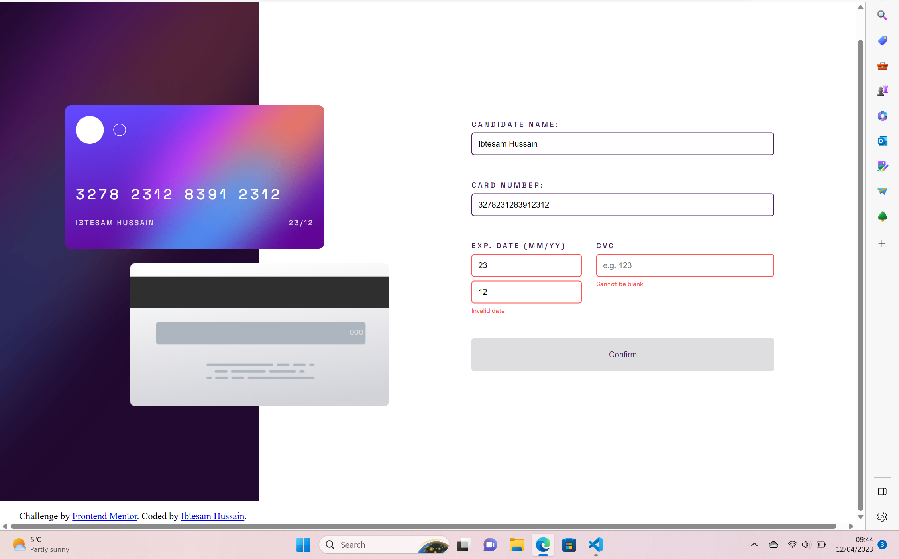
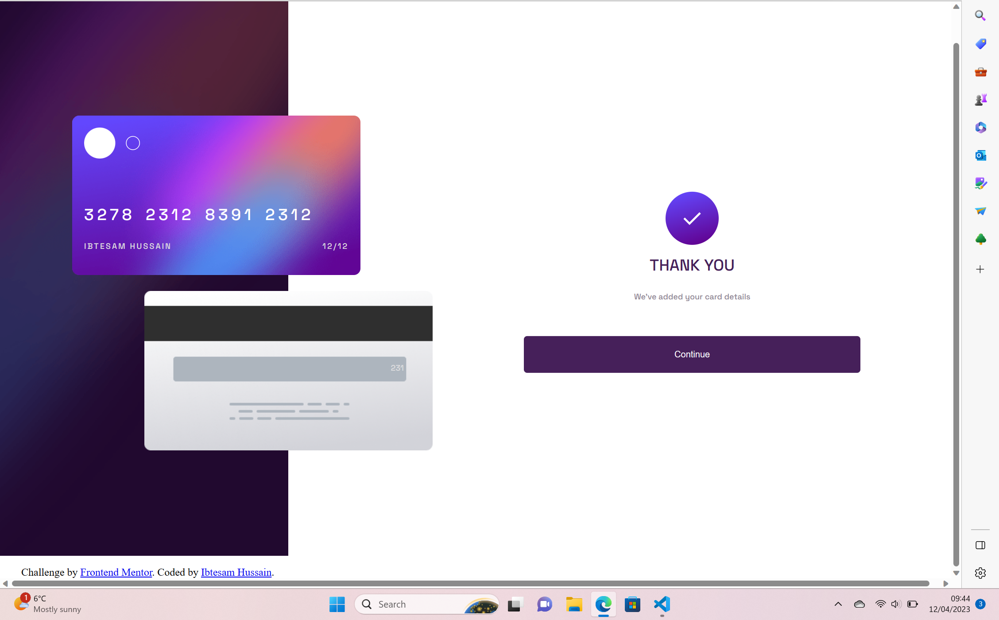
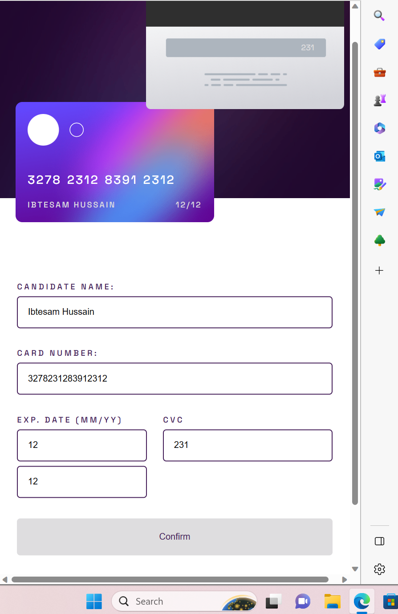
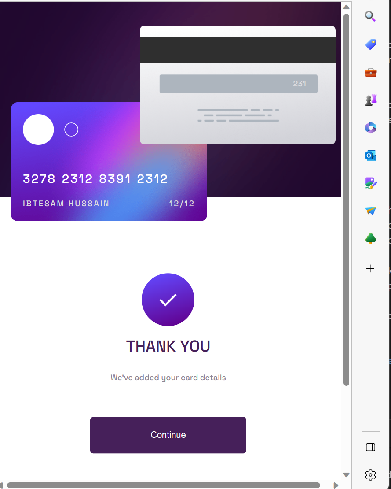

# Frontend Mentor - Interactive card details form solution

This is a solution to the [Interactive card details form challenge on Frontend Mentor](https://www.frontendmentor.io/challenges/interactive-card-details-form-XpS8cKZDWw). Frontend Mentor challenges help you improve your coding skills by building realistic projects. 

## Table of contents

- [Overview](#overview)
  - [The challenge](#the-challenge)
  - [Screenshot](#screenshot)
  - [Links](#links)
- [My process](#my-process)
  - [Built with](#built-with)
  - [What I learned](#what-i-learned)
  - [Continued development](#continued-development)
- [Author](#author)


## Overview

### The challenge

Users should be able to:

- Fill in the form and see the card details update in real-time
- Receive error messages when the form is submitted if:
  - Any input field is empty
  - The card number, expiry date, or CVC fields are in the wrong format
- View the optimal layout depending on their device's screen size
- See hover, active, and focus states for interactive elements on the page

### Screenshot

;
;
;
;
;

### Links

- Solution URL: https://github.com/IbtesamH/interactive-card-details.git
- Live Site URL: https://ibtesamh.github.io/interactive-card-details/


## My process

### Built with

- Semantic HTML5 markup
- SASS
- Javacsript
- Flexbox

### What I learned

This is my first project where I incorporated a substantial amount of javascript. It hepled me better understand how functions work and are invoked and how cthe flow of the code executes.

for example:
```
function handleSubmit(e) {
    e.preventDefault();
    success = 0;
    validateName();
    validateNumber();
    validateDate();
    validateCvc();

    if(success == 4) {
        form.style.display = "none";
        completeContainer.style.display = "block";
    }
}
```

### Continued development

I look forward to further developing my understanding of javascript by incorporating other more advanced features of the language, such as objects.

## Author

- Website - [Ibtesam Hussain](https://www.your-site.com)
- Frontend Mentor - https://www.frontendmentor.io/profile/IbtesamH


